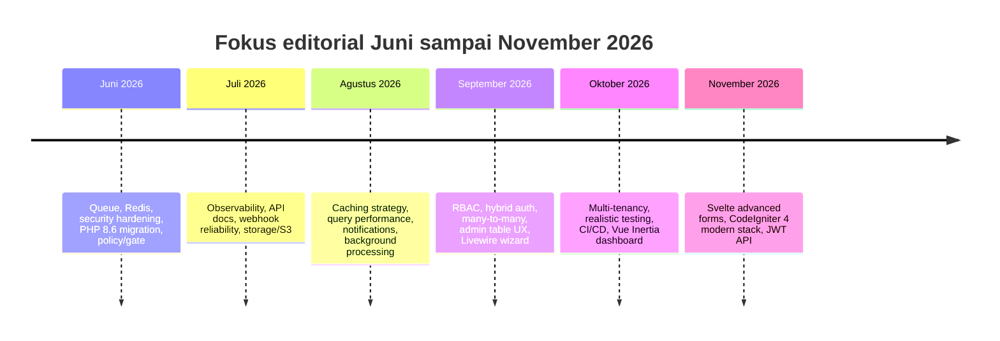

# Riset Mendalam Konten qadrLabs dan Seratus Ide Artikel Baru

## Ringkasan Eksekutif

Secara editorial, qadrLabs tampak sangat **tutorial-first** dan **series-driven**. Halaman series menampilkan struktur yang jelas: **23 post** untuk *Learn Laravel 13 Tutorial Series*, **16 post** untuk *Belajar Laravel 12*, **12 post** untuk *Belajar Laravel 11*, **7 post** untuk *Tutorial Next.js Auth*, **7 post** untuk *Tutorial Nuxt 4 Auth*, **6 post** untuk seri *SOLID Principles in Laravel*, dan **3 post** untuk *Membangun REST API dengan Go dan Gin Framework*. Di homepage, artikel yang sedang ditonjolkan sebagai konten yang “currently most accessed” adalah *How to Upgrade Laravel 12 to Laravel 13*, *Laravel 13 CRUD Tutorial*, dan *Laravel 13 Testing with Pest*. Artinya, gravitasi trafik saat ini kemungkinan besar ada pada jalur **upgrade → CRUD → testing → production patterns** di ekosistem Laravel. citeturn8view0turn16view0

Snapshot CSV yang Anda lampirkan berisi **271 baris**, tetapi hanya memiliki **dua field yang benar-benar tersedia**: `Judul Post` dan `Kategori`. Field lain yang Anda sebutkan—URL, tanggal, tag, summary, dan metrik performa—tidak hadir pada file ini, sehingga saya perlakukan sebagai **tidak terspesifikasi**. Karena itu, prioritas ide di bawah **bukan** berdasarkan CTR historis atau pageview per artikel, melainkan berdasarkan empat sinyal: konsentrasi kategori pada CSV, kemunculan tema di judul, visibilitas cluster di halaman live qadrLabs, dan celah tematik yang belum terlihat di arsip judul. Sebagai cross-check publik, halaman *Explore* menampilkan **270** artikel publik, kategori Laravel menampilkan **119** hasil, dan kategori CodeIgniter 4 menampilkan **19** hasil; selisih 1 item antara CSV dan halaman publik kemungkinan hanyalah perbedaan timing snapshot. citeturn3view4turn3view3turn9view0

Rekomendasi utamanya sederhana: **jangan melebar terlalu cepat**. qadrLabs sudah punya mesin pertumbuhan yang kuat di Laravel, terutama Laravel 13, lalu diperkuat oleh cluster auth, API, starter kit, testing, dan security. Rilisan terbaru juga menunjukkan pergeseran dari artikel pemula murni ke artikel yang lebih **production-grade**, misalnya *Audit GitHub Repository Security with Laravel Moat*, *PHP 8.6: What’s New and Changed*, seri SOLID di Laravel, serta *Passkeys in Laravel Starter Kits*. Itu berarti ide baru paling menjanjikan adalah artikel yang **memperdalam** cluster yang sudah menang—misalnya queue + Redis + Horizon, observability, API docs, webhook reliability, upload pipeline, RBAC/policy, dan multi-tenancy—bukan sekadar menambah topik baru yang berjauhan dari DNA arsip. citeturn16view0turn6view0turn7view0turn7view1turn7view2turn9view1

## Cakupan Dataset dan Batasan

| Item | Temuan |
|---|---|
| File utama | `posts-2026-05-27.csv` |
| Jumlah baris | 271 |
| Field yang tersedia | `Judul Post`, `Kategori` |
| Field yang tidak tersedia | URL, publish date, tag, summary, performance metrics |
| Kategori unik | 27 |
| Konsentrasi kategori | Laravel 119 artikel (43,9%); 5 kategori teratas menyumbang 71,2% snapshot |
| Cross-check live | Explore publik: 270 artikel; kategori Laravel: 119; kategori CodeIgniter 4: 19 |
| Implikasi | Prioritas ide bersifat **strategic-fit based**, bukan **historical-performance based** |

Secara live-site, qadrLabs memosisikan dirinya sebagai “hundreds of programming tutorials” dan membingkai pembelajaran melalui artikel, series, course, dan short notes. Homepage juga secara eksplisit memiliki area **“Learning without a laptop?”** yang menonjolkan konten Termux/Android, sehingga audiens qadrLabs bukan hanya desktop-first learner, tetapi juga pembaca dengan keterbatasan perangkat. citeturn3view0turn16view0

Keterbatasan terpenting dari riset ini adalah absennya data performa per artikel. Jadi, ketika saya memberi label **High / Medium / Low**, itu harus dibaca sebagai **priority for next publication**, bukan sebagai proyeksi trafik yang presisi. Skor prioritas terutama dipengaruhi oleh: kedekatan dengan cluster yang sudah ada, potensi internal linking, kecocokan dengan struktur series, kekuatan search intent praktis, dan besarnya gap topik di arsip judul.

## Analisis Tematik Artikel yang Ada

### Tema dominan

Berikut adalah delapan tema dominan yang saya deteksi dari judul artikel dalam CSV. Angkanya **overlapping**—satu artikel bisa masuk lebih dari satu tema.

| Tema dominan | Artikel terdeteksi | Interpretasi strategis |
|---|---:|---|
| Laravel & ecosystem | 128 | Inti brand dan pusat gravitasi trafik/editorial |
| Setup, install & tooling | 51 | Sangat kuat untuk akuisisi pembaca awal |
| API & integration | 51 | Jalur naik alami setelah CRUD/auth |
| PHP & OOP fundamentals | 46 | Fondasi kuat untuk pemula dan long-tail evergreen |
| CRUD & full-stack app building | 44 | Format paling reusable untuk series dan tutorial lanjutan |
| Authentication & access control | 41 | Cluster panjang umur lintas Laravel, CodeIgniter, Next.js, Nuxt |
| Clean code & architecture | 19 | Sedang naik, terutama via seri SOLID dan refactoring |
| Security & reliability | 15 | Makin kuat dan tampak semakin strategis pada rilisan terbaru |

Cerita tematik ini konsisten dengan halaman live qadrLabs. Kategori Laravel sangat dominan, tetapi bukan sekadar dominan secara jumlah; ia juga menjadi rumah bagi artikel upgrade, CRUD, testing, starter kit, semantic search, HTTP concurrency, encrypted casts, signed URLs, dan arsitektur bersih. Sementara itu, kategori CodeIgniter 4 menunjukkan pola modernisasi—Vite, Tailwind CSS v4, Bun, Pest, Shield, queue, dan upload/download—yang berarti cluster ini masih aktif dan layak diperdalam, bukan dijadikan arsip pasif. Di luar itu, seri Next.js Auth dan Nuxt 4 Auth yang terhubung langsung ke seri Go/Gin menunjukkan bahwa qadrLabs juga sedang membangun mini-ecosystem lintas-stack yang cukup khas. citeturn3view3turn9view0turn7view3turn7view4turn7view5turn11search6turn11search15

### Gap konten

Berdasarkan pencarian judul dalam CSV, gap yang paling jelas justru ada di area yang biasanya muncul ketika pembaca sudah naik dari level “belajar CRUD” ke level “menjalankan aplikasi nyata”.

| Gap | Kemunculan pada judul saat ini | Implikasi |
|---|---:|---|
| Observability / monitoring / logging | 0 | Celah terbesar untuk pembaca intermediate–senior |
| Redis / Horizon | 0 | Sangat layak jadi cluster baru di Laravel |
| Multi-tenancy / SaaS billing | 0 | Bernilai bisnis tinggi dan cocok jadi seri |
| Cloud deployment / AWS / Kubernetes | 0 | Bisa menyasar pembaca production-minded |
| Accessibility / SEO / analytics | 0 | Sangat berguna untuk qadrLabs sendiri dan pembaca publisher/dev blog |
| Playwright / Cypress | 0 | Testing modern belum tergarap |
| PostgreSQL umum | 1 | Baru tersentuh terutama lewat semantic search / pgvector |
| Realtime / WebSocket / Reverb | 1 | Potensi follow-up kuat dari chat/notification use cases |

Ini menjelaskan kenapa banyak ide prioritas tinggi dalam laporan ini berputar di **observability, Redis, policy/RBAC, API docs, webhook reliability, realistic testing, multi-tenancy, dan production file workflows**: semua topik tersebut **dekat secara kontekstual** dengan konten yang sudah ada, tetapi **belum padat** di arsip judul.

### Segmen audiens

Arsip qadrLabs terlihat melayani setidaknya enam segmen utama. Pertama, **pemula Laravel** yang masuk melalui tutorial berjenjang. Kedua, **developer Laravel intermediate** yang mulai butuh testing, auth, API, dan refactor. Ketiga, **maintainer PHP/CodeIgniter lama** yang sedang memodernisasi stack tanpa pindah total dari ekosistem lama. Keempat, **full-stack developer** yang tertarik pada kombinasi Laravel dengan Vue, Svelte, Livewire, Next.js, atau Nuxt. Kelima, **mobile-only learners** yang belajar melalui Termux/Android. Keenam, **cross-stack explorers** yang ingin membandingkan Laravel dengan Go/Gin, Spring Boot, Flask, atau Symfony. Segmentasi itu muncul cukup jelas dari series hub, kategori CodeIgniter 4, homepage “Learning without a laptop,” dan kemunculan artikulasi lintas-stack di Go/Gin, Next.js Auth, Nuxt 4 Auth, serta Java/Spring Boot. citeturn8view0turn9view0turn16view0turn11search6turn13search11

Catatan penting: walaupun tema testing hanya muncul lebih kecil bila dihitung dari judul, homepage justru menempatkan *Laravel 13 Testing with Pest* sebagai salah satu artikel yang sedang paling banyak diakses. Jadi testing adalah **small-by-count, high-by-strategic-value** dan patut di-overweight dalam roadmap. citeturn16view0turn15search4

## Seratus Ide Artikel Baru

Kode referensi di tabel ide mengacu pada tabel kunci berikut. Saya hanya mencantumkan URL jika berhasil saya verifikasi dari halaman live qadrLabs atau hasil pencarian situs. Cluster yang saya verifikasi secara langsung mencakup artikel Laravel 13 utama, semantic search, Svelte starter kit, Moat, PHP 8.6, SOLID, Passkeys, Sanctum, Socialite, Dusk, CodeIgniter 4 modern, Go/Gin, Next.js Auth, Nuxt 4 Auth, serta Spring Boot 4. citeturn7view0turn7view1turn7view2turn7view3turn7view4turn10search0turn10search1turn10search2turn10search3turn11search2turn11search6turn13search0turn13search1turn13search2turn14search1turn14search12turn15search0

### Kunci referensi

| Kode | Referensi artikel lama | URL jika terverifikasi |
|---|---|---|
| L1 | How to Upgrade Laravel 12 to Laravel 13: A Step-by-Step Guide | `https://qadrlabs.com/post/how-to-upgrade-laravel-12-to-laravel-13-a-step-by-step-guide` |
| L2 | Laravel 13 CRUD Tutorial: Build a Simple Blog Step by Step | `https://qadrlabs.com/post/laravel-13-crud-tutorial-build-a-simple-blog-step-by-step` |
| L3 | Laravel 13 Testing with Pest: Write Tests for Your CRUD Application | `https://qadrlabs.com/post/laravel-13-testing-with-pest-write-tests-for-your-crud-application` |
| L4 | Build an API Using JSON:API Specification with Laravel 13 | `https://qadrlabs.com/post/build-an-api-using-jsonapi-specification-with-laravel-13` |
| L5 | Laravel 13 Semantic Search: Add Smart Search to Your Blog | `https://qadrlabs.com/post/laravel-13-semantic-search-add-smart-search-to-your-blog` |
| L6 | Passkeys in Laravel Starter Kits: A First Look | `https://qadrlabs.com/post/passkeys-in-laravel-starter-kits-a-first-look` |
| L7 | SOLID Principles in Laravel: A Practical Introduction for Real-World Projects | `https://qadrlabs.com/post/solid-principles-in-laravel-a-practical-introduction-for-real-world-projects` |
| L8 | Service Class, Action Class, and Use Case Class: What They Are and When to Use Each in Laravel | `https://qadrlabs.com/post/service-class-action-class-and-use-case-class-what-they-are-and-when-to-use-each-in-laravel` |
| L9 | Using Invokable Controllers as Action Classes in Laravel | `https://qadrlabs.com/post/using-invokable-controllers-as-action-classes-in-laravel` |
| L10 | Refactoring Magic Strings to PHP Enums in Laravel 13 | `https://qadrlabs.com/post/refactoring-magic-strings-to-php-enums-in-laravel-13` |
| L11 | Build AI App dengan Laravel AI SDK | `https://qadrlabs.com/post/build-ai-app-dengan-laravel-ai-sdk` |
| L12 | Panduan Lengkap: Cara Integrasi RabbitMQ dengan Laravel sebagai Queue Driver | `https://qadrlabs.com/post/panduan-lengkap-cara-integrasi-rabbitmq-dengan-laravel-sebagai-queue-driver` |
| L13 | REST API Authentication With Laravel Sanctum | `https://qadrlabs.com/post/rest-api-authentication-with-laravel-sanctum` |
| L14 | REST API CRUD With Laravel Sanctum | `https://qadrlabs.com/post/rest-api-crud-with-laravel-sanctum` |
| L15 | Tutorial Laravel 11: Membuat fitur Login With Google menggunakan Laravel Socialite | `https://qadrlabs.com/post/membuat-fiitur-login-with-google-menggunakan-laravel-socialite` |
| L16 | Tutorial Laravel 11: Browser Testing Menggunakan Laravel Dusk | `https://qadrlabs.com/post/percobaan-browser-testing-menggunakan-laravel-dusk` |
| L17 | Tutorial CRUD Laravel 12 Untuk Pemula | `https://qadrlabs.com/post/tutorial-crud-laravel-12-untuk-pemula` |
| L18 | Laravel Svelte Starter Kit: Build a CRUD Blog with Svelte 5 and Inertia.js | `https://qadrlabs.com/post/laravel-svelte-starter-kit-build-a-crud-blog-with-svelte-5-and-inertiajs` |
| L19 | Audit GitHub Repository Security with Laravel Moat | `https://qadrlabs.com/post/audit-github-repository-security-with-laravel-moat` |
| L20 | PHP 8.6: What's New and Changed | `https://qadrlabs.com/post/php-86-whats-new-and-changed` |
| L21 | Integrating Vite, Tailwind CSS v4, and Bun with CodeIgniter 4 (Without a Vite Package) | `https://qadrlabs.com/post/integrating-vite-tailwind-css-v4-and-bun-with-codeigniter-4-without-a-vite-package` |
| L22 | Testing CRUD Features in CodeIgniter 4 with Pest (Part 2 of 2) | `https://qadrlabs.com/post/testing-crud-features-in-codeigniter-4-with-pest-part-2-of-2` |
| L23 | Tutorial CodeIgniter 4: Login dan Register menggunakan CodeIgniter Shield | `https://qadrlabs.com/post/tutorial-codeigniter-4-login-dan-register-menggunakan-codeigniter-shield` |
| L24 | Spring Boot 4 CRUD Tutorial: Build a Simple Blog Step by Step | `https://qadrlabs.com/post/spring-boot-4-crud-tutorial-build-a-simple-blog-step-by-step` |
| L25 | Spring Boot 4 Testing Tutorial: Test the CRUD Blog with JUnit 5, Mockito, and MockMvc | `https://qadrlabs.com/post/spring-boot-4-testing-tutorial-test-the-crud-blog-with-junit-5-mockito-and-mockmvc` |
| L26 | Membangun REST API dengan Go dan Gin Framework | `https://qadrlabs.com/series/membangun-rest-api-dengan-go-dan-gin-framework` |
| L27 | Tutorial Next.js Auth: Membangun Sistem Authentication dengan Next.js dan Go API | `https://qadrlabs.com/series/tutorial-nextjs-auth-membangun-sistem-authentication-dengan-nextjs-dan-go-api` |
| L28 | Tutorial Nuxt 4 Auth: Sistem Authentication dengan Go REST API | `https://qadrlabs.com/series/tutorial-nuxt-4-auth-sistem-authentication-dengan-go-rest-api` |

### Prioritas tinggi

| Idea title | Rationale singkat | Referensi prior | Prioritas | Target audiens | Format | Est. kata |
|---|---|---|---|---|---|---|
| Laravel 13 Queue + Redis + Horizon: Menangani Job Nyata Tanpa Bottleneck | Mengembangkan cluster queue yang sudah ada ke pola yang paling dicari untuk aplikasi nyata: Redis, retry, failed jobs, dan dashboard worker. | L12, L2, L3 | High — dekat dengan cluster Laravel 13 + queue + testing yang sudah kuat dan mudah dijadikan seri lanjutan. | Developer Laravel intermediate | tutorial | 2400–3000 |
| Observability di Laravel 13 dengan Telescope, Pulse, dan Structured Logging | Situs kuat di build/tutorial, tetapi tidak ada konten observability yang eksplisit; ini celah besar untuk tim yang mulai production-ready. | L2, L3, L19 | High — gap jelas, intent praktis tinggi, dan cocok untuk audience yang naik level dari CRUD ke operasi. | Developer Laravel intermediate–senior | how-to | 2200–2800 |
| Laravel 13 Webhook Idempotency dan Replay Protection untuk Payment Gateway | Melanjutkan topik verifikasi signature ke implementasi yang lebih production-grade: duplicate event, retry, dan audit trail. | L19 | High — security + payments + backend reliability memberi nilai tinggi dan jarang dibahas detail. | Backend engineer Laravel | case study | 2000–2600 |
| Membangun Audit Trail di Laravel 13 dengan Activity Log dan Model Events | Topik ini menyambung artikel CRUD, auth, dan clean code dengan use case nyata seperti histori perubahan data admin. | L2, L8, L9 | High — sangat relevan untuk aplikasi admin panel dan SaaS, serta mudah diinternal-link dari banyak artikel lama. | Developer Laravel aplikasi bisnis | tutorial | 1800–2400 |
| Laravel 13 Soft Delete, Restore, dan Data Pruning untuk Aplikasi Admin | Artikel CRUD yang ada berhenti di operasi dasar; artikel ini memberi langkah next-level yang sangat lazim dibutuhkan aplikasi produksi. | L2, L17 | High — extension natural dari konten CRUD yang sudah terbukti menarik di homepage dan series. | Pemula–intermediate Laravel | tutorial | 1600–2200 |
| Pipeline Upload Gambar di Laravel 13: Validasi, Resize, Kompresi, dan Storage | Situs sudah punya upload, download, dan kompresi; artikel baru bisa menggabungkan semuanya ke pipeline yang lebih lengkap. | L2, L17 | High — intent praktis tinggi dan banyak reuse ke artikel starter kit, API, dan admin panel. | Full-stack Laravel developer | tutorial | 2200–3000 |
| Role-Based Access Control di Laravel 13 dengan Spatie Permission | Konten auth kuat, tetapi RBAC modern dan authorization level tim/aplikasi patut dipisah jadi panduan end-to-end. | L6, L13, L15 | High — auth adalah cluster lama yang konsisten, dan RBAC punya demand implementasi yang tinggi. | Developer Laravel intermediate | tutorial | 2000–2600 |
| Laravel 13 API Docs Otomatis dari Kode dengan OpenAPI dan Dokumentasi Example Response | Sambungan alami dari JSON:API, Sanctum, dan seri API; fokus pada dokumentasi yang maintainable untuk tim. | L4, L13, L14 | High — API cluster besar dan dokumentasi API sering menjadi kebutuhan nyata perusahaan. | Backend/API engineer | how-to | 1800–2400 |
| Laravel 13 Query Performance: Index, EXPLAIN, eager loading, dan N+1 | Situs sudah punya artikel N+1 dan Eloquent helper; artikel baru bisa menyatukan optimasi query secara sistematis. | L2 | High — performa database adalah gap strategis dengan intent kuat dan cocok untuk update seri Laravel 13. | Developer Laravel intermediate | tutorial | 2300–3000 |
| Caching di Laravel 13 dengan Redis: Cache Aside, TTL, Tag, dan Stampede Protection | Saat ini caching tampak minim; artikel ini membuka sub-cluster baru yang sangat production-oriented. | L17 | High — gap eksplisit di judul CSV dan sangat penting untuk aplikasi skala nyata. | Backend engineer Laravel | how-to | 2200–2800 |
| Laravel 13 Background Image Processing dengan Queue dan Event | Menggabungkan unggah file, kompresi gambar, dan queue ke alur asynchronous yang lebih realistis. | L12, L17 | High — memperpanjang tiga cluster yang sudah ada menjadi satu use case kuat. | Full-stack Laravel developer | case study | 1800–2400 |
| API Versioning di Laravel 13 Tanpa Merusak Client Lama | API sudah banyak dibahas, tetapi versioning, deprecation, dan backward compatibility belum tampak eksplisit. | L4, L13, L14 | High — relevan untuk pembaca API yang sudah bergerak dari pemula ke maintenance. | Backend/API engineer | reference guide | 1800–2300 |
| Laravel 13 Multi-Tenancy Dasar untuk SaaS Kecil | Tidak terlihat coverage multi-tenant di judul yang ada; padahal ini jalan naik yang masuk akal setelah CRUD dan auth. | L2, L6, L8 | High — gap besar, nilai bisnis tinggi, dan bisa menjadi seri baru. | Founder-dev, engineer SaaS | tutorial | 2600–3400 |
| Testing Database Nyata di Laravel 13 dengan PostgreSQL dan Pest | Setelah CRUD + Pest, kebutuhan pembaca berikutnya biasanya bukan test syntax lagi tetapi environment test yang lebih mirip produksi. | L3, L5 | High — mengikuti artikel testing yang sudah trending di homepage. | Developer Laravel intermediate | tutorial | 1800–2400 |
| CI/CD Laravel 13 dengan GitHub Actions, Test Matrix, dan Deployment Gate | Sudah ada GitHub Actions, tetapi bisa dinaikkan menjadi pipeline lengkap dengan checks, artifacts, dan manual approval. | L3, L19 | High — kombinasi teaching value + production relevance tinggi. | Engineer Laravel/DevOps | how-to | 2200–3000 |
| Hybrid Auth di Laravel: Passkeys + Social Login + Email Login dalam Satu Starter Kit | Passkeys dan Socialite sudah ada sebagai potongan terpisah; artikel baru menyatukan opsi auth modern ke satu UX. | L6, L15 | High — auth cluster terbukti panjang umur dan topik ini masuk fase adoption sekarang. | Full-stack Laravel developer | tutorial | 2200–2800 |
| Laravel 13 Reverb untuk Notifikasi Realtime dan Presence Channel | Ada satu artikel chat realtime, tetapi belum terlihat pedoman realtime modern yang terfokus pada Laravel 13. | L17 | High — realtime adalah gap jelas dan sangat menarik untuk seri lanjutan. | Developer Laravel intermediate | tutorial | 2200–2800 |
| Membangun Form Wizard Multi-Step di Livewire 4 | Livewire sudah disentuh di CRUD, tetapi use case form wizard biasanya punya intent implementasi yang tinggi di pencarian. | L17, L3 | High — sangat turunan dari cluster CRUD yang sedang kuat. | Developer Laravel/Livewire | tutorial | 1700–2300 |
| Vue 3 + Inertia di Laravel 13 untuk Dashboard Admin yang Lebih Kompleks | Setelah CRUD blog, langkah berikutnya yang logis adalah dashboard multi-resource dengan table, filter, dan form reuse. | L18, L2 | High — memperdalam full-stack starter kit yang sudah banyak muncul di seri. | Full-stack Laravel developer | case study | 2600–3400 |
| Svelte 5 + Inertia di Laravel 13 untuk Form Dinamis dan Validasi Kompleks | Artikel starter kit Svelte sangat kuat; follow-up yang lebih advanced akan menangkap pembaca yang ingin melangkah dari blog demo. | L18 | High — seri starter kit ideal untuk dipecah per use case nyata. | Full-stack Laravel developer | tutorial | 2000–2600 |
| CodeIgniter 4 Auth Lanjutan dengan Shield: Role, Permission, dan Email Verification | Shield sudah dibahas, tetapi implementasi role/permission dan verifikasi email belum terlihat sebagai panduan tersendiri. | L23 | High — auth selalu hijau dan cocok untuk basis pembaca CodeIgniter 4. | Developer CodeIgniter 4 | tutorial | 1800–2400 |
| CodeIgniter 4 REST API dengan JWT, Request Validation, dan Rate Limiting | Menggabungkan cluster API, auth, dan security modern ke ekosistem CodeIgniter 4. | L23, L21 | High — memperluas CodeIgniter 4 dari CRUD ke API-ready use case. | Backend developer CodeIgniter 4 | tutorial | 2200–2800 |
| CodeIgniter 4 + Pest untuk Menguji Login, Upload, dan CRUD dalam Satu Suite | Part 2 testing sudah ada; artikel ini bisa menjadi paket integrasi testing fitur lintas-modul yang lebih lengkap. | L22, L23 | High — kelanjutan paling dekat dari artikel testing CI4 terbaru. | Developer CodeIgniter 4 | tutorial | 1900–2500 |
| Template Modern CodeIgniter 4 dengan Vite, Tailwind v4, dan TypeScript | Artikel Vite+Tailwind+Bun membuka pintu besar untuk template starter yang bisa dipakai ulang pembaca. | L21 | High — sangat dekat dengan rilisan terbaru dan berpotensi jadi evergreen entry point baru. | Developer CodeIgniter 4 | how-to | 2000–2600 |
| Panduan Praktis Migrasi dari PHP 8.5 ke PHP 8.6 untuk Proyek Nyata | Situs sudah mengulas fitur baru PHP 8.6; sekarang butuh panduan migrasi yang fokus pada keputusan teknis di codebase nyata. | L20 | High — piggyback pada topik release yang baru dan berpotensi dicari tinggi. | Developer PHP | migration guide | 2000–2600 |
| Membangun Library PHP yang Siap Pakai: Versioning, Semantic Release, dan CI | Artikel publish ke Packagist sudah ada; follow-up ini fokus pada lifecycle paket setelah rilis pertama. | L20 | High — cocok untuk audience intermediate yang ingin naik dari belajar ke distribusi. | Developer PHP intermediate | how-to | 1800–2400 |
| GitHub Repository Hardening Checklist untuk Proyek PHP dan Laravel | Moat memberi audit; artikel ini mengubah hasil audit menjadi checklist operasional yang bisa dipakai tim. | L19 | High — security + actionable checklist = format yang mudah di-share dan dikonversi. | Tech lead, maintainer OSS | checklist | 1500–2100 |
| Supply Chain Security untuk Composer: Audit, Pinning, Signed Tags, dan Review Dependabot | Setelah kasus npm/Composer/supply chain, pembaca butuh panduan lintas-alat yang lebih umum dari satu tool tertentu. | L19, L20 | High — memanfaatkan momentum security yang baru muncul di qadrlabs. | PHP/Laravel maintainer | how-to | 1900–2500 |
| Laravel 13 untuk SaaS Billing Sederhana dengan Midtrans | Sudah ada payment gateway dalam konteks SOLID/PHP; artikel baru bisa membawa use case bisnis ke Laravel modern. | L7 | High — pembayaran adalah use case bisnis yang besar dan belum jadi seri kuat. | Founder-dev, backend engineer | case study | 2200–3000 |
| Laravel 13 Policy dan Gate untuk Otorisasi Per Resource | RBAC dan login sudah ada, tetapi policy/gate memberi level kontrol akses yang lebih granular dan educational. | L6, L13 | High — auth cluster kuat dan policy adalah celah implementatif yang nyata. | Developer Laravel intermediate | tutorial | 1700–2300 |
| Laravel 13 File Upload ke S3-Compatible Storage dengan Signed URLs | Menggabungkan storage, signed URL, dan upload workflow ke use case cloud-friendly yang lebih nyata. | L19, L17 | High — sangat implementatif dan mudah dilink dari artikel upload/download. | Developer Laravel | tutorial | 1900–2500 |
| Laravel 13 Pivot Table dan Relasi Many-to-Many dari Nol sampai Sync | Artikel CRUD dasar akan lebih lengkap bila punya lanjutan tentang relasi yang sering membuat pemula tersandung. | L2, L17 | High — sangat dekat dengan kebutuhan pembaca CRUD yang sedang aktif. | Pemula Laravel | tutorial | 1800–2400 |
| Laravel 13 Pagination, Filter, Sort, dan Search untuk Tabel Admin | Banyak tutorial CRUD berhenti di operasi dasar; artikel ini memberi layer UX yang paling sering dibutuhkan berikutnya. | L2, L17 | High — keyword praktis dan high-intent untuk aplikasi internal/admin. | Developer Laravel | tutorial | 1800–2400 |
| Laravel 13 Notifications: Email, Database, dan Broadcast dalam Satu Alur | Setelah auth dan CRUD, notifikasi adalah modul aplikasi yang paling sering dibutuhkan berikutnya. | L2, L6 | High — extension natural dari aplikasi nyata dan jarang dibahas tuntas di arsip. | Full-stack Laravel developer | tutorial | 1900–2500 |

### Prioritas menengah

| Idea title | Rationale singkat | Referensi prior | Prioritas | Target audiens | Format | Est. kata |
|---|---|---|---|---|---|---|
| Elasticsearch vs Meilisearch vs Database Search di Laravel | qadrlabs sudah punya Elasticsearch dan semantic search; artikel banding akan membantu keputusan tool yang lebih jelas. | L5 | Medium — strong decision-intent, tetapi sedikit lebih niche daripada tutorial implementasi. | Tech lead, backend engineer | comparison | 1800–2400 |
| Membangun API Search dengan pgvector di Laravel dari Nol | Artikel semantic search sudah kuat; artikel ini mengisolasi bagian infrastruktur vector DB agar jadi entry point yang lebih ramah. | L5, L11 | Medium — bagus untuk memperluas AI cluster, tetapi lebih teknis. | Developer Laravel/AI | how-to | 2300–3000 |
| JSON:API Lanjutan di Laravel 13: Filtering, Sorting, Pagination, Sparse Fieldsets | Artikel JSON:API dasar sudah ada; artikel baru mengisi halaman dua untuk implementasi API yang lebih lengkap. | L4 | Medium — sangat cocok sebagai sekuel tetapi tidak seluas CRUD dasar. | API engineer Laravel | tutorial | 2100–2700 |
| Cookbook Validasi Laravel 13 untuk Form Kompleks | Setelah CRUD dan refactor controller, kumpulan pola validasi akan sangat mudah diinternal-link dari banyak artikel. | L2, L3 | Medium — utilitas tinggi, meski bukan keyword paling seksi. | Pemula–intermediate Laravel | cookbook | 1800–2400 |
| Task Scheduler Laravel untuk Backup, Cleanup, dan Laporan Harian | Queue sudah ada; scheduler adalah pasangan alaminya untuk otomasi operasional aplikasi. | L12, L19 | Medium — cocok untuk cluster production-ready. | Developer Laravel/ops | how-to | 1700–2300 |
| Disaster Recovery Laravel: Backup Database, Storage, dan Secrets | Qadrlabs sudah menyentuh backup otomatis MySQL; artikel baru menggabungkannya menjadi playbook recovery aplikasi. | L19 | Medium — sangat berguna, tetapi audiens lebih banyak tim/ops daripada pemula. | Tech lead, DevOps, maintainer | checklist | 2000–2600 |
| Migrasi Laravel dari SQLite ke MySQL atau PostgreSQL | Banyak tutorial CRUD mulai dari SQLite/default local; artikel migrasi akan menjawab fase transisi yang sering membingungkan. | L2, L17 | Medium — sangat aplikatif, namun demand ada setelah pembaca menyelesaikan tutorial awal. | Pemula–intermediate Laravel | migration guide | 1800–2400 |
| Benchmark Lokal: FrankenPHP vs PHP-FPM vs Octane untuk Laravel 13 | FrankenPHP dan Octane sudah muncul; artikel benchmark memberi hook yang mudah diklik dan dibagikan. | L12, L20 | Medium — menarik untuk performance-minded reader, tapi lebih eksperimental. | Laravel/ops engineer | benchmark | 2000–2600 |
| Docker Compose untuk Laravel 13 Lokal: PHP, Nginx, MySQL, Redis, Mailpit | Konten Docker/FrankenPHP sudah ada; artikel ini menawarkan stack lokal yang lebih dekat ke kebutuhan tim kecil. | L1, L12 | Medium — utilitas tinggi, meski keyword persaingan besar. | Developer Laravel | tutorial | 2200–2800 |
| RabbitMQ Delay Queue, Retry, dan Dead Letter Pattern di Laravel | Artikel RabbitMQ dasar ada, tetapi pola retry dan dead-letter biasanya yang benar-benar dibutuhkan sistem produksi. | L12 | Medium — relevansi tinggi, tetapi audience sedikit lebih teknis. | Backend engineer | tutorial | 2200–2800 |
| Signed URL vs Temporary URL vs Private Disk di Laravel | Melanjutkan artikel secure download links ke matriks keputusan storage dan akses file yang lebih utuh. | L19 | Medium — topik file security kuat, tapi use case lebih sempit. | Developer Laravel | comparison | 1600–2200 |
| Email Delivery yang Andal di Laravel: Queue, Retry, dan Monitoring | Sudah ada SMTP Gmail dan queue; gabungan ini lebih dekat ke use case aplikasi produksi. | L12 | Medium — topik praktis yang cenderung evergreen. | Full-stack Laravel developer | how-to | 1700–2300 |
| PDF di Laravel: DomPDF, Snappy, dan Browsershot untuk Use Case Berbeda | Qadrlabs punya PDF di CodeIgniter dan export di Laravel; artikel perbandingan akan memetakan opsi output dokumen di Laravel. | L17 | Medium — use case cukup umum, tapi tidak sepenting auth/API. | Developer aplikasi bisnis | comparison | 1800–2400 |
| Excel di Laravel: Import, Export, Validation, dan Queue Processing | Upload/import/export sudah ada pada artikel lama; kebutuhan berikutnya adalah workflow Excel yang tahan data besar. | L17 | Medium — sangat aplikatif untuk aplikasi admin. | Developer aplikasi bisnis | tutorial | 2200–2800 |
| QR Code di Laravel untuk Check-In, Serial Number, atau Deep Link | Artikel QR code sudah ada; versi baru bisa memfokuskan use case konkret yang lebih siap dipakai tim produk. | L17 | Medium — bagus sebagai niche expansion. | Developer full-stack | case study | 1600–2200 |
| Multilingual di Laravel dengan Slug, Prefix, dan SEO Friendly URL | Ada percobaan localization pada CRUD app; artikel baru bisa menutup gap implementasi multilingual yang lebih rapi. | L17 | Medium — relevan, tetapi intent pencari lebih sempit. | Developer Laravel | tutorial | 1900–2500 |
| Memilih Admin Panel di Laravel: Filament vs CRUD Custom | qadrlabs sudah punya CRUD manual dan Filament; artikel ini membantu pembaca memilih jalur implementasi. | L2 | Medium — decision-intent kuat, tetapi agak lebih sempit. | Tech lead, developer Laravel | comparison | 1700–2200 |
| Livewire 4 untuk Table, Filter, dan Modal CRUD yang Reusable | Kelanjutan yang sangat natural dari CRUD + Livewire agar pembaca bisa membangun panel admin lebih efisien. | L17, L3 | Medium — bagus untuk memperdalam salah satu starter path yang ada. | Developer Laravel/Livewire | tutorial | 1900–2500 |
| Next.js Auth Lanjutan: Refresh Token, Middleware, dan Protect Server Actions | Series Next.js auth berhenti pada flow dasar; artikel ini menambah lapisan security dan DX yang penting. | L27, L26 | Medium — seri sudah kuat, tetapi audience lebih spesifik. | Full-stack JS/PHP dev | tutorial | 2200–2800 |
| Next.js App Router untuk Dashboard Data-Heavy + Go API | Langkah berikutnya setelah auth dasar adalah fetching, caching, dan route protection untuk dashboard nyata. | L27, L26 | Medium — cocok sebagai season dua dari series Next.js. | Frontend/full-stack developer | case study | 2400–3000 |
| Nuxt 4 Auth Lanjutan: Refresh Token Rotation dan Protected Server Route | Menyambung seri Nuxt 4 Auth ke kebutuhan keamanan yang lebih production-ready. | L28, L26 | Medium — relevan untuk pembaca seri, namun niche framework-specific. | Frontend/full-stack developer | tutorial | 2100–2700 |
| Go Gin Middleware: Logging, Panic Recovery, dan Rate Limiting | API Go/Gin saat ini fokus fondasi; artikel middleware akan menjadikannya lebih production-ready. | L26 | Medium — sangat masuk akal sebagai kelanjutan seri. | Backend developer Go | tutorial | 1900–2500 |
| Go Gin File Upload dan Image Processing API | Melanjutkan seri Go/Gin dari CRUD/auth ke media processing sehingga stack back-end jadi lebih lengkap. | L26 | Medium — bagus untuk melengkapi seri API. | Backend developer Go | tutorial | 1900–2500 |
| Spring Boot 4 Auth dengan JWT untuk Pembaca PHP yang Ingin Membandingkan | Karena sekarang sudah ada CRUD dan testing Spring Boot, auth adalah langkah komparatif berikutnya. | L24, L25 | Medium — cross-stack menarik, tetapi audience lebih kecil. | Developer PHP yang eksplor Java | tutorial | 2200–2800 |
| Migrasi CodeIgniter 3 ke CodeIgniter 4 Secara Bertahap | Qadrlabs punya jejak kuat di CI3 dan CI4; artikel ini membantu pembaca lama masuk ke stack yang lebih modern. | L23 | Medium — relevansi historis tinggi bagi pembaca lama qadrlabs. | Maintainer legacy PHP | migration guide | 2200–3000 |
| Membangun Package Laravel Internal untuk Reuse Antarproyek | Setelah publish PHP library, langkah logis berikutnya adalah package Laravel internal dengan service provider dan config publish. | L20, L10 | Medium — audience lebih mature tetapi loyal. | Developer Laravel/PHP | how-to | 1900–2500 |
| Custom Artisan Command yang Benar: Input, Confirm, Dry Run, dan Logging | Ada artikel prompt dan custom command; artikel baru fokus pada pola command yang aman untuk produksi. | L19 | Medium — berguna dan dekat dengan article history, tetapi bukan traffic magnet utama. | Developer Laravel | tutorial | 1700–2300 |
| Repository Pattern di Laravel Tanpa Over-Engineering pada Aplikasi CRUD | Situs sudah punya satu artikel repository pattern; turunan ini fokus pada kapan pattern itu membantu dan kapan tidak. | L7, L8 | Medium — topik kuat untuk audience intermediate, tetapi lebih niche dibanding CRUD/security. | Developer Laravel intermediate | comparison | 1800–2200 |
| DDD Lite di Laravel: Memisahkan Domain, Use Case, dan Infrastruktur Tanpa Ribet | Melanjutkan lini Service/Action/Use Case ke arsitektur yang sedikit lebih matang, namun tetap pragmatis. | L8, L9 | Medium — bagus untuk memperdalam clean code cluster, meski audience lebih sempit. | Senior-ish Laravel developer | tutorial | 2300–3000 |
| CQRS Lite di Laravel untuk Dashboard Admin Bertrafik Tinggi | Mengubah materi clean architecture menjadi use case read/write separation yang aplikatif. | L8, L9 | Medium — bernilai tinggi tetapi lebih niche dan butuh framing yang kuat. | Laravel engineer senior | case study | 2200–2800 |
| Membuat Paket Rate Limiter PHP yang Rilis ke Packagist | Menggabungkan artikel rate limiter dan publish package menjadi project-based tutorial yang kuat. | L20 | Medium — format project build menarik, tetapi audience lebih sempit. | Developer PHP intermediate | project tutorial | 2200–2800 |
| Kapan Trait Menolong dan Kapan Diganti Composition di PHP | Melanjutkan artikel traits menjadi decision guide yang lebih mudah dipahami tim coding sehari-hari. | L20 | Medium — berguna, tetapi lebih niche dibanding Laravel operational topics. | Developer PHP intermediate | comparison | 1500–2100 |
| PHP Enums Lanjutan: Backed Enum, Cast, Validation, dan Mapping | Setelah artikel enum/refactor, pembaca akan membutuhkan kumpulan pola enum yang lebih mendalam. | L10, L20 | Medium — bagus untuk modern PHP cluster. | Developer PHP | reference guide | 1700–2300 |
| CodeIgniter 4 DataTable Modern dengan Vite dan Server-Side Filtering | Menggabungkan warisan DataTables qadrlabs dengan integrasi build modern di CI4. | L21, L22 | Medium — cocok untuk audience admin panel dan migrasi stack lama. | Developer CodeIgniter 4 | tutorial | 1800–2400 |
| CodeIgniter 4 OpenAPI/Swagger untuk REST API Internal | Ada API dan Shield, tetapi dokumentasi API modern di CodeIgniter 4 belum tampak kuat. | L23, L21 | Medium — bagus untuk memperluas cluster API CI4. | Backend developer CodeIgniter 4 | how-to | 1800–2400 |
| Browser Testing Modern: Kapan Dusk Cukup, Kapan Perlu Playwright | Menghubungkan Dusk article dengan kebutuhan e2e modern dan keputusan tool yang sering membingungkan tim. | L16, L3 | Medium — decision article bagus, meski perlu framing yang tajam. | Tech lead, QA-minded developer | comparison | 1800–2400 |
| Tutorial Site Analytics: Event Tracking, Scroll Depth, dan Funnel ke Signup | Karena qadrlabs punya series, login, dan courses, artikel analytics akan sangat relevan bagi site-owner audience. | L19 | Medium — lebih meta, namun bernilai bisnis tinggi dan belum terlihat di arsip. | Developer, indie maker, publisher | tutorial | 1800–2400 |
| Sitemap, Canonical, dan Structured Data untuk Blog Laravel | Tidak ada cluster SEO di dataset; artikel ini membuka kategori baru yang tetap relevan dengan produk situs saat ini. | L2 | Medium — bukan core technical backend, tapi sangat strategis untuk pertumbuhan organik qadrlabs sendiri. | Publisher dev blog, full-stack dev | how-to | 1700–2300 |
| Playwright untuk Laravel: E2E Testing yang Lebih Fleksibel daripada Dusk | Dusk sudah ada, tetapi Playwright membuka sudut pandang modern untuk pengujian lintas browser dan komponen frontend. | L16, L3 | Medium — testing penting secara strategis, meski lebih niche daripada CRUD. | Engineer Laravel/QA | tutorial | 2000–2600 |
| Laravel 13 dengan PostgreSQL: Setup, Migration, UUID, dan Query Khas | pgvector sudah memperkenalkan PostgreSQL, tetapi pembaca butuh panduan dasar penggunaan PostgreSQL di Laravel sehari-hari. | L5 | Medium — berguna untuk memperkuat cluster database, tetapi bukan keyword terluas. | Backend Laravel developer | tutorial | 2100–2700 |
| Laravel 13 Observer, Event, dan Listener untuk Memisahkan Side Effects | Ini menyambung clean code dan CRUD ke pattern event-driven yang lebih maintainable. | L8, L9 | Medium — sangat relevan, meski sedikit lebih konseptual. | Developer Laravel intermediate | how-to | 1900–2500 |
| CodeIgniter 4 Image Upload Pipeline dengan Resize, Validasi, dan Storage Strategy | Upload file sudah ada, tetapi pipeline gambar lengkap dan maintainable belum terlihat sebagai topik spesifik. | L21, L22, L23 | Medium — masuk akal sebagai turunan cluster CI4 terbaru. | Developer CodeIgniter 4 | tutorial | 1900–2500 |
| CodeIgniter 4 Seeder, Factory, dan Dummy Data untuk Testing dan Demo | Data seeding ada di arsip, tetapi artikel modern yang menyambungkan ke testing dan development flow masih potensial. | L22 | Medium — nilai praktis bagus untuk pembaca CI4. | Developer CodeIgniter 4 | how-to | 1700–2300 |
| CodeIgniter 4 Role dan Permission Sederhana Tanpa Paket Tambahan | Sebagian pembaca CI4 mungkin ingin solusi ringan sebelum memakai paket auth lebih besar. | L23 | Medium — praktis dan cocok dengan karakter CI yang ringan. | Developer CodeIgniter 4 | tutorial | 1700–2300 |
| Nuxt 4 Auth + RBAC di UI: menu, halaman, dan composable permissions | Melengkapi seri auth dasar dengan use case interface dan hak akses. | L28 | Medium — bagus sebagai sekuel framework-specific. | Frontend/full-stack developer | tutorial | 1900–2500 |
| Go Gin JWT Refresh Token dan Logout yang Aman | Series Go/Gin saat ini menyentuh auth, CRUD, dan upload file; refresh token akan melengkapi seri auth-nya. | L26 | Medium — lanjutan yang logis untuk seri Go/Gin. | Backend developer Go | tutorial | 1800–2400 |

### Prioritas rendah

| Idea title | Rationale singkat | Referensi prior | Prioritas | Target audiens | Format | Est. kata |
|---|---|---|---|---|---|---|
| Deploy CodeIgniter 4 ke VPS dengan PHP-FPM dan Nginx | CodeIgniter 4 punya momentum baru; panduan deploy bisa menutup missing link dari tutorial lokal ke produksi. | L21, L23 | Low — audience lebih kecil daripada Laravel, tetapi masih solid. | Developer CodeIgniter 4 | tutorial | 2200–2800 |
| Deploy Laravel ke VPS dengan Nginx, Supervisor, SSL, dan Zero-Downtime | Melengkapi env setup dan queue management dengan panduan deploy yang lebih matang. | L12, L19 | Low — utilitas tinggi, tapi keyword ramai dan perlu banyak screenshot/ops detail. | Developer Laravel/DevOps | step-by-step | 2400–3200 |
| Alternatif Heroku untuk Laravel pada 2026 | Ada artikel deploy Heroku lama; pembaruan versi platform akan menangkap intent yang lebih aktual. | L1 | Low — berguna, namun butuh update berkala dan bukan cluster terkuat. | Developer Laravel | listicle | 1700–2300 |
| Android + Firebase + PHP API: Arsitektur Mini untuk Aplikasi Internal | Ada satu artikel Firebase Android; artikel baru bisa mempertautkan mobile client dengan backend PHP sederhana. | L13 | Low — sangat niche, tetapi bisa jadi differentiator. | Developer mobile/backend pemula | case study | 1800–2400 |
| Symfony 8 API Platform untuk Developer yang Sudah Paham Laravel API | Membawa kategori API lama ke konteks modern dan pembaca yang ingin memperluas horizon stack PHP. | L4 | Low — bermanfaat tapi bukan inti demand qadrlabs saat ini. | Backend developer PHP | comparison/how-to | 2000–2600 |
| Symfony 8 CRUD untuk Developer Laravel: Apa yang Terasa Berbeda | Ada jejak Symfony di arsip, tetapi belum menjadi cluster aktif; artikel ini mengaktifkan kembali long-tail PHP framework audience. | L17 | Low — eksploratif dan niche. | Developer PHP yang membandingkan framework | tutorial | 2200–2800 |
| Dari Flask ke Laravel: Peta Migrasi Konsep API untuk Developer Python | Qadrlabs cukup unik karena punya Flask API dan Laravel API; artikel komparatif bisa menarik pembaca lintas-ekosistem. | L13 | Low — audience niche tapi diferensiatif. | Developer Python yang berpindah ke PHP | comparison | 1800–2400 |
| Menyambungkan Laravel ke Python Service untuk Embeddings dan Inference | Artikel AI SDK dan semantic search sudah ada; artikel ini membuka arsitektur hybrid PHP+Python yang realistis. | L5, L11 | Low — teknis tinggi dan audience relatif sempit, tetapi unik. | Engineer AI/full-stack | architecture guide | 2400–3200 |
| Jupyter Notebook untuk Developer Web: Kapan Perlu dan Kapan Tidak | Karena ada artikel ML dan install Jupyter, artikel keputusan ini akan membantu pembaca baru memahami konteks penggunaannya. | L11 | Low — lebih eksploratif daripada inti audience qadrlabs. | Developer backend yang penasaran AI/ML | comparison | 1500–2000 |
| Bun untuk Developer PHP: Kapan Layak Menggantikan npm | qadrlabs sudah masuk ke Bun lewat CI4/Laravel; artikel eksplainer akan menjembatani pembaca PHP yang penasaran. | L21 | Low — menarik, tetapi audience campuran dan intent tidak selalu tinggi. | Developer PHP full-stack | comparison | 1600–2200 |
| Composer Security di macOS dan Linux: Audit Paket, Cache, dan Token Hygiene | Menyambung security dan install topics ke praktik harian tool composer itu sendiri. | L19, L20 | Low — penting tetapi lebih utilitarian. | Developer PHP | checklist | 1500–2100 |
| Accessibility untuk Form Login dan Register di Starter Kit Modern | Mengembangkan cluster auth ke aspek UX berkualitas yang belum tampak di arsip. | L6, L15, L23 | Low — insight penting, tetapi bukan kata kunci inti audience saat ini. | Frontend/full-stack developer | checklist | 1500–2100 |
| Roadmap Kontribusi Open Source untuk Developer PHP | qadrlabs punya jejak artikel kontribusi; artikel baru bisa menjadi panduan action plan 30 hari untuk pembaca. | L19 | Low — bagus untuk brand building, tetapi tidak sekomersial topik inti. | Junior developer | roadmap | 1500–2100 |
| PSR-12, php-cs-fixer, dan Review Checklist untuk Tim Kecil | Meneruskan PSR-1 ke workflow team modern yang lebih praktis dan langsung bisa diterapkan. | L20 | Low — penting namun lebih operasional internal team. | Tim developer PHP | checklist | 1600–2200 |
| Membangun Workstation PHP di Ubuntu 26.04 untuk Coding Harian | Ada banyak artikel Ubuntu, PHP, dan Laravel env; artikel ini bisa menjadi super-guide yang merangkum semuanya. | L20 | Low — berguna, tetapi keyword cukup umum dan tidak sedekat cluster trending. | Developer PHP/Laravel | setup guide | 2200–2800 |
| Termux 2026 untuk Belajar PHP: Dari Composer sampai Laravel Minimal | Segmen “learning without a laptop” sudah nyata di homepage; artikel ini memperbarui jalur belajar mobile-only. | L20 | Low — audience jelas tetapi lebih sempit daripada topik Laravel utama. | Pelajar mobile-only | how-to | 1700–2200 |
| Spring Boot 4 REST API Tutorial untuk Pembaca yang Sudah Ikut CRUD | Setelah CRUD dan testing, API adalah kelanjutan paling logis untuk cluster Spring Boot yang baru tumbuh. | L24, L25 | Low — cluster masih kecil, tetapi baik untuk eksplorasi cross-stack. | Developer Java pemula | tutorial | 2200–2800 |
| Git Branching untuk Solo Developer vs Tim Kecil | Ada artikel Git dasar dan kontribusi; artikel ini mengangkat praktik kolaborasi yang lebih nyata. | L19 | Low — bermanfaat, tetapi bukan pembeda utama dibanding topik framework. | Junior–intermediate developer | comparison | 1500–2100 |
| Spring Boot 4 Security dengan Spring Security dan Role-Based Access | Menambah artikel auth/security ke pasangan CRUD+testing yang sudah ada. | L24, L25 | Low — berguna, namun cluster Java masih kecil dibanding Laravel. | Developer Java pemula | tutorial | 2200–2800 |
| Next.js 16 + Laravel 13 sebagai BFF dan Authentication Gateway | Menyatukan dua cluster populer qadrlabs menjadi arsitektur full-stack lintas framework yang unik. | L27, L2 | Low — diferensiatif, tetapi audience gabungan lebih sempit. | Full-stack architect | architecture guide | 2400–3200 |

## Pilar Konten dan Kalender Editorial

Pilar yang saya rekomendasikan bukan dibuat dari nol; semuanya adalah penguatan terhadap apa yang sudah berhasil di qadrLabs. Karena Laravel sangat dominan di arsip dan series, pilar pertama harus tetap **Laravel production patterns**. Pilar kedua adalah **security, auth, dan reliability**, karena rilisan terbaru jelas bergerak ke sana. Pilar ketiga adalah **PHP craftsmanship & testing**, sebagai perekat antara konten dasar dan konten Laravel yang lebih advanced. Pilar keempat adalah **full-stack starter kits & modern UI**, karena qadrLabs sudah punya jalur Vue/Svelte/Next/Nuxt yang nyata. Pilar kelima adalah **CodeIgniter & cross-stack modernization**, agar brand tidak kehilangan pembaca historisnya dan tetap punya diferensiasi lintas-ekosistem. citeturn8view0turn9view0turn9view1turn7view4turn7view5

| Pilar | Porsi rekomendasi | Fokus |
|---|---:|---|
| Laravel production patterns | 35% | queue, cache, observability, storage, API, DB performance |
| Security, auth, reliability | 20% | passkeys, policy/RBAC, webhook safety, GitHub/composer hardening |
| PHP craftsmanship & testing | 15% | PHP 8.6 migration, package building, enums/traits, Playwright/Pest |
| Full-stack starter kits & modern UI | 15% | Vue/Inertia, Svelte/Inertia, Livewire, Next.js/Nuxt auth expansions |
| CodeIgniter & cross-stack modernization | 15% | CodeIgniter 4 API/testing/auth modern, Go/Gin, limited Spring Boot expansion |

### Sampel kalender editorial enam bulan

Asumsi kalender ini adalah **empat artikel major per bulan** sebagai baseline yang realistis untuk kualitas qadrLabs saat ini. Semua slot memprioritaskan ide berlabel **High**.

| Bulan | Fokus utama | Artikel prioritas |
|---|---|---|
| Juni 2026 | Menangkap momentum rilisan dan security | Laravel 13 Queue + Redis + Horizon; GitHub Repository Hardening Checklist; Panduan Praktis Migrasi dari PHP 8.5 ke PHP 8.6; Laravel 13 Policy dan Gate |
| Juli 2026 | Production hardening | Observability di Laravel 13; Laravel 13 API Docs Otomatis; Laravel 13 Webhook Idempotency; Laravel 13 File Upload ke S3-Compatible Storage |
| Agustus 2026 | Performance & async workflows | Caching di Laravel 13 dengan Redis; Laravel 13 Query Performance; Laravel 13 Notifications; Laravel 13 Background Image Processing |
| September 2026 | Aplikasi bisnis nyata | Role-Based Access Control di Laravel 13; Hybrid Auth di Laravel; Laravel 13 Pivot Table; Membangun Form Wizard Multi-Step di Livewire 4 |
| Oktober 2026 | Naik kelas ke arsitektur SaaS | Laravel 13 Multi-Tenancy Dasar; Testing Database Nyata di Laravel 13; CI/CD Laravel 13; Vue 3 + Inertia di Laravel 13 untuk Dashboard Admin |
| November 2026 | Diversifikasi adjacency | Svelte 5 + Inertia di Laravel 13; Template Modern CodeIgniter 4; CodeIgniter 4 Auth Lanjutan dengan Shield; CodeIgniter 4 REST API dengan JWT |

## SEO untuk Sepuluh Ide Teratas

Karena dataset tidak memuat data query historis, daftar berikut sebaiknya diperlakukan sebagai **seed keyword clusters**, bukan volume-validated keywords. Saya sengaja memilih ide yang punya kombinasi tertinggi antara **search intent praktis**, **kedekatan dengan cluster qadrLabs yang sudah menang**, dan **potensi internal linking**.

| Ide | Primary keyword | Secondary keyword cluster | Intent |
|---|---|---|---|
| Laravel 13 Queue + Redis + Horizon | `laravel 13 queue redis horizon` | `failed jobs laravel`, `horizon setup laravel`, `redis queue laravel tutorial` | how-to |
| Observability di Laravel 13 | `laravel observability tutorial` | `laravel telescope`, `laravel pulse`, `structured logging laravel`, `monitoring laravel app` | how-to |
| Laravel 13 API Docs Otomatis | `laravel openapi documentation` | `api docs laravel`, `generate swagger laravel`, `document sanctum api` | how-to |
| Laravel 13 Webhook Idempotency | `laravel webhook idempotency` | `replay protection laravel`, `payment webhook laravel`, `secure webhook laravel` | problem-solving |
| Caching di Laravel 13 dengan Redis | `laravel redis cache tutorial` | `cache aside laravel`, `cache tags laravel`, `stampede protection laravel` | how-to |
| RBAC di Laravel 13 dengan Spatie Permission | `spatie permission laravel 13` | `rbac laravel`, `roles permissions laravel`, `middleware permission laravel` | how-to |
| Hybrid Auth di Laravel | `laravel passkeys social login` | `laravel webauthn`, `laravel socialite login`, `passwordless login laravel` | how-to / comparison |
| Panduan Praktis Migrasi PHP 8.6 | `php 8.6 migration guide` | `upgrade php 8.6`, `php 8.6 breaking changes`, `php 8.6 new features practical` | migration |
| Template Modern CodeIgniter 4 | `codeigniter 4 vite tailwind typescript` | `vite codeigniter 4`, `tailwind codeigniter 4`, `bun codeigniter 4` | how-to |
| GitHub Repository Hardening Checklist | `github repository security checklist` | `laravel moat guide`, `github hardening php`, `dependabot security checklist` | checklist |

## Metrik yang Direkomendasikan

Karena file tidak memuat metrik performa historis, saya tidak menetapkan target numerik baseline. Namun, untuk siklus editorial berikutnya, saya sangat menyarankan qadrLabs melacak metrik di level **article, cluster, dan series** sekaligus; kalau tidak, Anda akan tahu artikel mana yang “ramai”, tetapi tidak tahu cluster mana yang benar-benar menggerakkan pembaca dari discovery ke deeper learning. Struktur site qadrLabs—articles, series, login/register, dan courses—secara alami cocok untuk model metrik bertingkat seperti ini. citeturn16view0turn8view0turn12search11

| Metrik | Mengapa penting | Level |
|---|---|---|
| Organic clicks | Mengukur artikel mana yang benar-benar menarik trafik search | artikel |
| Impressions | Melihat seberapa luas query footprint per topik | artikel / cluster |
| CTR organik | Menguji kualitas judul dan meta description | artikel |
| Average position pada keyword target | Mengukur apakah artikel menutup gap SEO yang diinginkan | artikel |
| Engaged sessions / average engagement time | Membedakan klik dangkal vs baca serius | artikel |
| Scroll depth | Sangat penting untuk tutorial panjang; menguji ketepatan struktur | artikel |
| Internal CTR ke artikel lanjutan | Mengukur kekuatan content cluster dan series handoff | cluster / series |
| Series completion rate | Relevan karena qadrLabs sangat series-driven | series |
| CTA CTR ke login / register / course | Menghubungkan konten dengan outcome bisnis | artikel / cluster |
| Returning visitor rate per cluster | Mengukur apakah satu topik membangun habit belajar | cluster |
| 30/90/180 day traffic decay | Menentukan artikel mana yang perlu refresh/update | artikel |
| Assisted conversion by cluster | Menguji tema mana yang paling membantu signup/course, meski bukan last click | cluster |

Secara praktik, saya akan memecah dashboard menjadi tiga panel. **Panel editorial**: clicks, impressions, CTR, average position. **Panel engagement**: engaged sessions, scroll depth, internal CTR, series completion. **Panel business**: CTA CTR ke login/register/course, assisted conversion, dan return visits. Dengan struktur itu, Anda bisa membedakan artikel yang bagus untuk **akuisisi**, artikel yang bagus untuk **retensi belajar**, dan artikel yang bagus untuk **konversi**.

