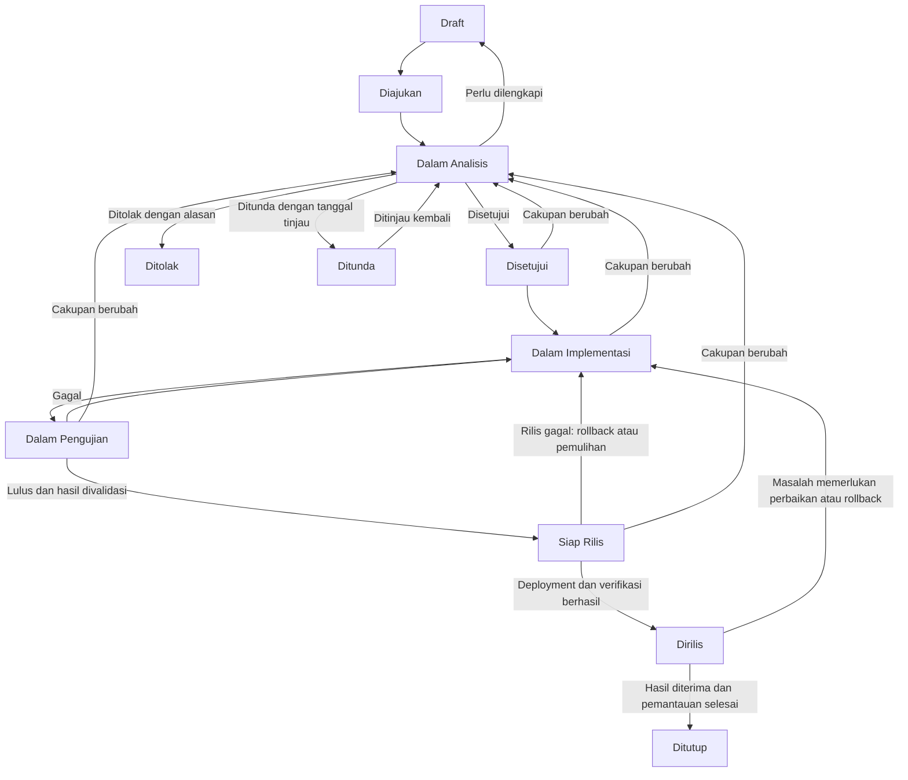

# Alur Change Request Software Development

Panduan untuk mengelola permintaan perubahan (change request atau CR) dalam tim internal, mulai dari pengajuan hingga hasilnya diterima. Gunakan CR untuk perubahan kebutuhan, perilaku, atau cakupan pekerjaan yang perlu dianalisis dan disepakati bersama.

Formulir: [[template-change-request|Template Change Request]].

## Cara menggunakan

1. Salin template ke folder proyek terkait di `01-projects/`.
2. Beri nama `cr-yyyy-nnn-ringkasan-perubahan.md`, misalnya `cr-2026-001-tambah-filter-laporan.md`.
3. Gunakan ID `CR-YYYY-NNN`, dengan nomor berurutan per proyek dan tahun. Cantumkan nama proyek saat merujuk CR lintas proyek.
4. Lengkapi bagian secara bertahap sesuai proses. Bagian yang belum dikerjakan ditandai `Belum diisi`; bagian yang tidak relevan diisi `Tidak berlaku` dengan alasan singkat.
5. Perbarui status, versi dokumen, dan riwayat ketika ada perubahan keputusan atau isi yang bermakna. Simpan bukti berupa tautan task, pull request, hasil pengujian, atau catatan persetujuan.

Template tetap disimpan sebagai referensi. Dokumen CR yang sudah diisi menjadi bagian dari dokumentasi proyek dan mengikuti pengarsipan proyek tersebut.

## Peran

| Peran | Tanggung jawab |
| --- | --- |
| Pemohon | Menjelaskan kebutuhan, memberi klarifikasi, dan memvalidasi hasil dari sisi penggunaan. |
| Penanggung jawab proyek / product owner | Menentukan prioritas, menyetujui cakupan dan estimasi, serta menutup CR. Tetapkan satu nama sebagai pemberi keputusan. |
| Developer / tech lead | Menganalisis dampak dan kelayakan, menyusun rencana teknis, serta mengimplementasikan perubahan. |
| QA / reviewer | Memeriksa acceptance criteria, regresi, dan bukti pengujian. |
| PIC rilis | Menjalankan deployment, verifikasi, pemantauan, dan rollback atau pemulihan bila diperlukan. |

Satu orang dapat memegang beberapa peran. Nama penanggung jawab dan bukti keputusan tetap dicatat.

## Diagram alur

CR aktif sebelum rilis juga dapat dipindahkan ke `Ditunda` atau `Dibatalkan` oleh penanggung jawab proyek. Catat alasan, pekerjaan yang sudah dilakukan, dan tindak lanjut. Setelah perubahan dirilis, pembatalan harus ditangani melalui rollback atau CR lanjutan agar kondisi sistem tetap tercatat.

## Tahapan dan syarat perpindahan

| Status | Penanggung jawab | Aktivitas dan syarat keluar |
| --- | --- | --- |
| Draft | Pemohon | Isi identitas, kondisi saat ini, perubahan, tujuan, cakupan awal, prioritas beserta alasan, dan acceptance criteria awal sebelum diajukan. |
| Diajukan | Penanggung jawab proyek | Periksa kelengkapan, tentukan PIC analisis, lalu pindahkan ke Dalam Analisis. Pengajuan belum berarti persetujuan pengerjaan. |
| Dalam Analisis | Developer / tech lead | Tinjau kelayakan, dampak, risiko, dependensi, estimasi usaha dan jadwal, serta rencana uji dan rilis. Perjelas acceptance criteria bersama pemohon. Ajukan hasil analisis kepada pemberi keputusan. |
| Disetujui | Penanggung jawab proyek | Catat nama pemberi persetujuan, tanggal, versi dokumen, cakupan, dan estimasi yang disepakati. Tentukan PIC serta jadwal implementasi. Mulai implementasi setelah persetujuan tercatat. |
| Dalam Implementasi | Developer | Kerjakan cakupan yang disetujui, tautkan task dan pull request, lakukan review kode serta pengujian awal. Pindahkan ke Dalam Pengujian ketika perubahan siap diuji dan bukti pekerjaan tersedia. |
| Dalam Pengujian | QA / reviewer | Uji acceptance criteria, regresi, dan aspek teknis yang terdampak. Pemohon memvalidasi hasil penggunaan. Lanjutkan setelah seluruh kriteria terpenuhi dan tidak ada temuan yang menghalangi rilis. |
| Siap Rilis | PIC rilis | Pastikan bukti uji, validasi pemohon, jadwal rilis, komunikasi, langkah deployment, dan rencana rollback atau pemulihan tersedia. Jalankan rilis; pindahkan ke Dirilis setelah deployment dan verifikasi awal berhasil. |
| Dirilis | PIC rilis dan pemohon | Pantau selama periode yang ditetapkan dalam CR, catat hasil serta insiden, dan konfirmasi hasil di lingkungan tujuan. Ajukan penutupan setelah pemantauan selesai dan hasil diterima. |
| Ditutup | Penanggung jawab proyek | Catat penerimaan hasil, pembaruan dokumentasi, dan tindak lanjut beserta PIC. Status akhir untuk CR yang selesai. |

## Keputusan dan kondisi khusus

| Kondisi | Tindakan |
| --- | --- |
| Informasi belum cukup | Kembalikan dari Dalam Analisis ke Draft dengan daftar klarifikasi; pemohon melengkapi lalu mengajukan kembali. |
| Ditolak | Pemberi keputusan mencatat alasan dan tanggal. Status akhir; usulan baru dibuat sebagai CR baru dengan tautan ke CR ini. |
| Ditunda | Catat alasan, PIC tindak lanjut, serta tanggal atau kondisi peninjauan. Saat dilanjutkan, kembali ke Dalam Analisis untuk memastikan rencana masih sesuai. |
| Dibatalkan | Penanggung jawab proyek mencatat alasan dan penanganan pekerjaan yang sudah dilakukan. Status akhir. |
| Cakupan, acceptance criteria, biaya, atau jadwal yang disepakati berubah | Hentikan pekerjaan yang terdampak, naikkan versi dokumen, dan kembali ke Dalam Analisis untuk mendapatkan persetujuan ulang. Riwayat persetujuan sebelumnya tetap disimpan. |
| Pengujian gagal | Catat hasil aktual dan temuan, kembali ke Dalam Implementasi, lalu uji ulang setelah perbaikan. |
| Rilis gagal atau muncul masalah setelah rilis | PIC rilis menjalankan rollback atau pemulihan sesuai pemicu yang dicatat, memverifikasi kondisi sistem, dan memberi tahu pihak terkait. Catat insiden serta versi yang aktif, lalu kembali ke Dalam Implementasi untuk perbaikan dan pengujian ulang. |
| Perubahan tidak dapat di-rollback langsung | Tentukan rencana pemulihan sebelum rilis, termasuk penanganan data, PIC, dan verifikasi. Jangan menganggap rollback aplikasi otomatis memulihkan data. |
| Ada kebutuhan tambahan setelah CR ditutup | Buat CR baru dan tautkan ke CR sebelumnya. |

## Prioritas dan bukti keputusan

Gunakan prioritas `Rendah`, `Sedang`, `Tinggi`, atau `Kritis` berdasarkan dampak dan urgensi. Jelaskan siapa yang terdampak, akibat jika ditunda, dan tenggat yang mendasari prioritas. Prioritas tinggi atau kritis tetap mengikuti alur persetujuan ini; panduan ini tidak menetapkan jalur darurat terpisah.

Persetujuan dapat dicatat langsung di dokumen atau melalui tautan keputusan yang dapat diakses tim. Persetujuan harus merujuk versi dokumen tertentu agar cakupan, acceptance criteria, dan estimasinya jelas. Persetujuan awal tidak menggantikan bukti pengujian dan kesiapan rilis.

#software-development #change-request #workflow
